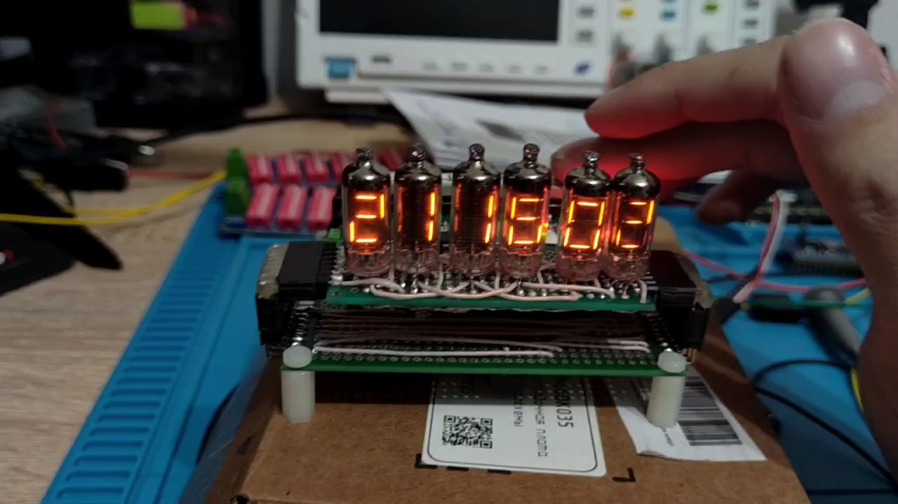
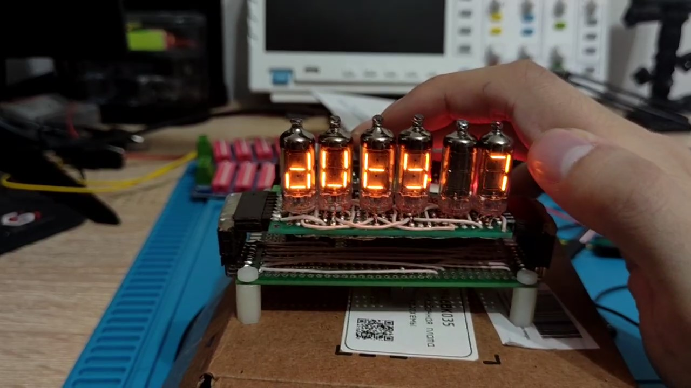
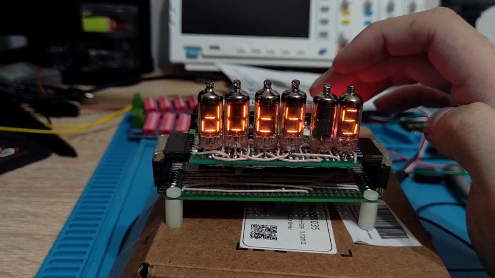

# Ламповые часы на STM32

Полностью законченный проект настольных часов на шести ламповых семисегментных индикаторах. Для устройства были разработаны прошивка, схемотехника, платы и рабочий прототип.

*Обычный режим работы: отображение часов, минут и секунд.*

*Установка минимального уровня яркости `DUTY 1`.*

*Отображение времени после установки `DUTY 1`. Освещение и положение камеры не менялись, поэтому снижение яркости можно сравнить с первым кадром.*

> На кадрах показан ранний прототип: в нём уже работали отображение времени и часть настроек. Игры и плавное переливание цифр были добавлены в прошивку позднее.

## Видеодемонстрация

[▶ Смотреть видеодемонстрацию часов на Яндекс Диске](https://disk.yandex.ru/d/FJQ9Txn4kVEkkw)

## Особенности проекта

- управление индикаторами напрямую от STM32 через дискретные транзисторные каскады, без специализированного драйвера индикации;
- динамическая индикация шести разрядов с регулировкой яркости;
- плавные переходы между цифрами с настраиваемой скоростью;
- часы реального времени на встроенном RTC;
- кнопочное меню с фильтрацией дребезга и обработкой длительного нажатия;
- настройка времени, яркости, эффектов и звуков;
- таймер и секундомер;
- три мини-игры: проверка чувства секунды, тест реакции и кликер;
- воспроизведение мелодий и звуковых сигналов через пьезоизлучатель;
- сохранение пользовательских настроек в backup-регистрах RTC.

## Аппаратная часть

Устройство построено на `STM32F103`. Коммутация разрядов и сегментов выполнена на транзисторах и других дискретных компонентах. Проект прошёл путь от макетного прототипа до собственных печатных плат.

## Программная часть

Прошивка написана на C с использованием STM32 HAL. Обновление индикации выполняется по таймеру, яркость и звуковой генератор управляются с помощью PWM, а пользовательский интерфейс построен как иерархическое меню.

Основные каталоги:

- `Core/Clock` — управление индикацией, временем и звуком;
- `Core/Menu` — меню, настройки, таймер, секундомер и игры;
- `Core/Src` — инициализация микроконтроллера и обработчики периферии;
- `lamp.ioc` — конфигурация STM32CubeMX;
- `MDK-ARM/lamp.uvprojx` — проект Keil MDK.

## Технологии

`Embedded C` · `STM32F103` · `STM32 HAL` · `GPIO` · `таймеры` · `PWM` · `RTC` · `прерывания` · `Keil MDK` · `STM32CubeMX` · `Altium Designer`
